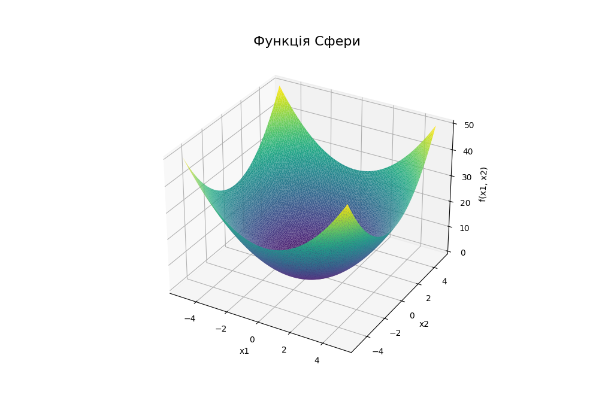
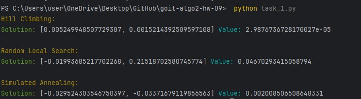
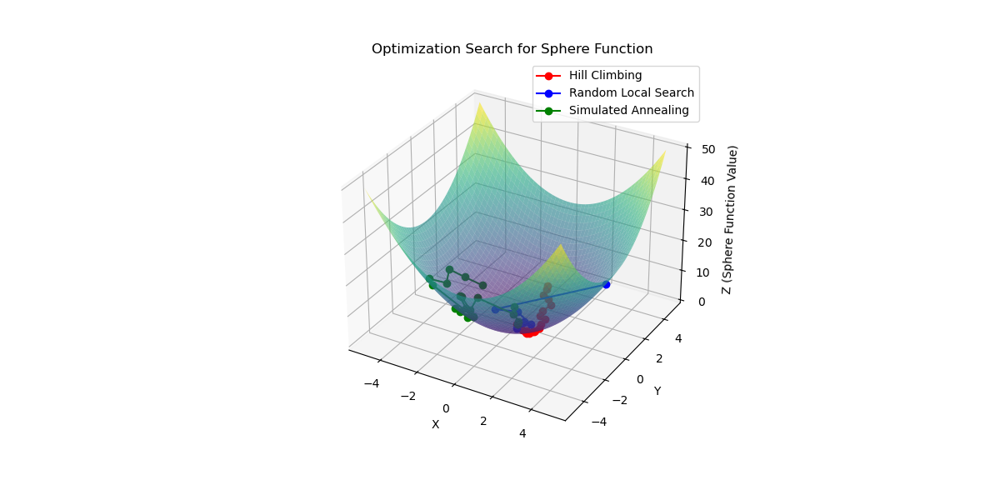

# HW-9 | Local Search, Heuristics, and Simulated Annealing

## Introduction 🧠

Today, you will practice using three different local optimization approaches to minimize the Sphere function: Hill Climbing, Random Local Search, and Simulated Annealing.

You will understand the principles behind these algorithms, including how to tune parameters such as the number of iterations, sensitivity to improvements (epsilon), and temperature settings (for Simulated Annealing).

This assignment will help you grasp the differences between the methods, their strengths and weaknesses, and evaluate their efficiency in finding approximate minima in a multi-dimensional space.

Let’s get started! 💪🏼

---

## Task Description

Implement a program to minimize the Sphere function:  
\[
f(x) = \sum_{i=1}^{n} x_i^2
\]
using three different local optimization approaches:

1. **Hill Climbing**
2. **Random Local Search**
3. **Simulated Annealing**


---

## Technical Requirements

1. The function boundaries are defined as:  
   \[
   x_i \in [-5,5]
   \]
   for each parameter \( x_i \).

2. The algorithms must return the optimal point (a list of coordinates \( x \)) and the function value at this point.

3. Implement the three optimization methods:

   - `hill_climbing` — Hill Climbing algorithm.
   - `random_local_search` — Random Local Search.
   - `simulated_annealing` — Simulated Annealing.

4. Each algorithm must accept a parameter `iterations`, which defines the maximum number of iterations.

5. The algorithms should terminate under one of the following conditions:

   - The change in the objective function value or the solution's position in the search space between two consecutive iterations is smaller than `epsilon`. The `epsilon` parameter defines the algorithm's sensitivity to minor improvements.
   - For Simulated Annealing, temperature is considered: if the temperature decreases below `epsilon`, the algorithm stops, indicating exhaustion of its search capability.

---

## Acceptance Criteria 📌

These acceptance criteria are mandatory for mentor evaluation. If any of them are not met, the mentor will return the homework for revision without grading. If you need clarification 😉 or get stuck at any stage, reach out to your mentor on Slack.

- The algorithms operate within the given range \( x_i \in [-5, 5] \).
- The program finds an approximation of the global minimum of the function.
- The results of all three algorithms are presented in text format in a clear manner.

---

## Program Template

```python
import random
import math

# Define the Sphere function
def sphere_function(x):
    return sum(xi ** 2 for xi in x)

# Hill Climbing
def hill_climbing(func, bounds, iterations=1000, epsilon=1e-6):
    pass

# Random Local Search
def random_local_search(func, bounds, iterations=1000, epsilon=1e-6):
    pass

# Simulated Annealing
def simulated_annealing(func, bounds, iterations=1000, temp=1000, cooling_rate=0.95, epsilon=1e-6):
    pass

if __name__ == "__main__":
    # Define function bounds
    bounds = [(-5, 5), (-5, 5)]

    # Execute algorithms
    print("Hill Climbing:")
    hc_solution, hc_value = hill_climbing(sphere_function, bounds)
    print("Solution:", hc_solution, "Value:", hc_value)

    print("\nRandom Local Search:")
    rls_solution, rls_value = random_local_search(sphere_function, bounds)
    print("Solution:", rls_solution, "Value:", rls_value)

    print("\nSimulated Annealing:")
    sa_solution, sa_value = simulated_annealing(sphere_function, bounds)
    print("Solution:", sa_solution, "Value:", sa_value)
```
### Example Output

```yaml
Hill Climbing:
Solution: [0.0005376968388007969, 0.0007843237077809137] Value: 9.042815690435702e-07

Random Local Search:
Solution: [0.030871215407484165, 0.10545563391334589] Value: 0.012073922664800917

Simulated Annealing:
Solution: [0.024585173708439823, -0.00484719941675793] Value: 0.0006279261084599791
```

# TASK'S RESULT


